# runway-apron-crack-detection
OpenCV based Runway / Apron / Roads Crack Detection

# Runway - Apron - Bitumen Road – OpenCV crack detection

Everyday crores of rupees are being spent on airports/runways/aprons/highway/roads maintainance and restoration works all over the world. These expenses can be minimized if the detection of cracks can be detected as early as possible. The repair process depends on the type of cracks, the action needs to be taken on next steps on how it could be repaired. First we need to capture very images of the bitumen/concrete surfaces. Only high resolution camera devices should be used to capture images of the bitumen/concrete surfacess to apply various image processing techniques to extract crack information of the surface. This procedure can be implemented on images acquired by any equipment or vehicles carrying image sensing terminals, laser distance sensors, image storage and processing equipment, central control systems and speed sensors. The accuracy of the raster imaging depends on the quality of the images and angle / position accuracy.

### Introduction

Road safety is of paramount importance for everyone. If highway / road / runway / apron condition is derived well in advance, accidents can be avoided. Since the runways / aprons / roads / highways are built using different materials, cracks or holes in the asphalt/concrete surface occur due to heavy usage. As soon as the cracks are repaired, journey can be safe and the roads / runways / aprons life' span can be increased. Most of the accidents happen due to poor condition and lack of maintenance.

In modern countries, runways / apron maintenance is done every once in a year, but there are airports in every part of the world which goes unmaintained or unattended to. Including there are thousands of kilometers highways which makes it very difficult to inspect these roads by human eyes. So an efficient automatic detection of the road condition has been developed for making them safe.
These cracks of the runways / aprons / roads / highways can be classified into different types. Depending on the type of crack, respective stakeholders must take actions how those cracks can be repaired. Initially it may need to detect the location of the cracks such as the place of crack, area of crack etc. To perform this special activity, a visual inspection technique is required to capture images of the runways / apron / roads / highways and then analyze it further.

Our ultimate goal is to develop a system that is capable to detect these cracks on the runways / aprons / roads / highways automatically.

### Process

Crack detection methodology classification:

Step 1: Image capture
Step 2: Image processing
Step 3: Image Segmentation
Step 4: Feature extraction

#### Image capture

Any advanced camera equipment can be installed on a vehicle’s zenith point or in a pole that is capable of capturing high resolution images of surfaces such as runways / aprons / roads / highway from any angle but focus should be extremely perfect. If needed; the original images could be resized. Here are some examples of images on which we are going to detect cracks.

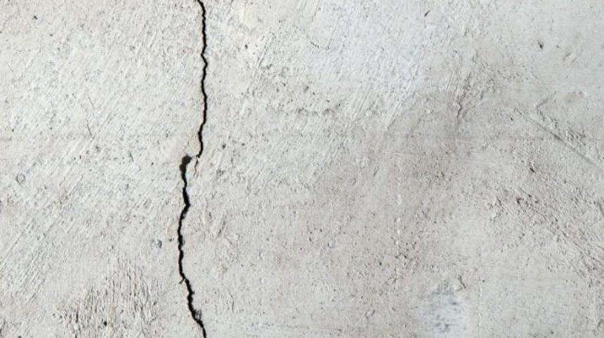 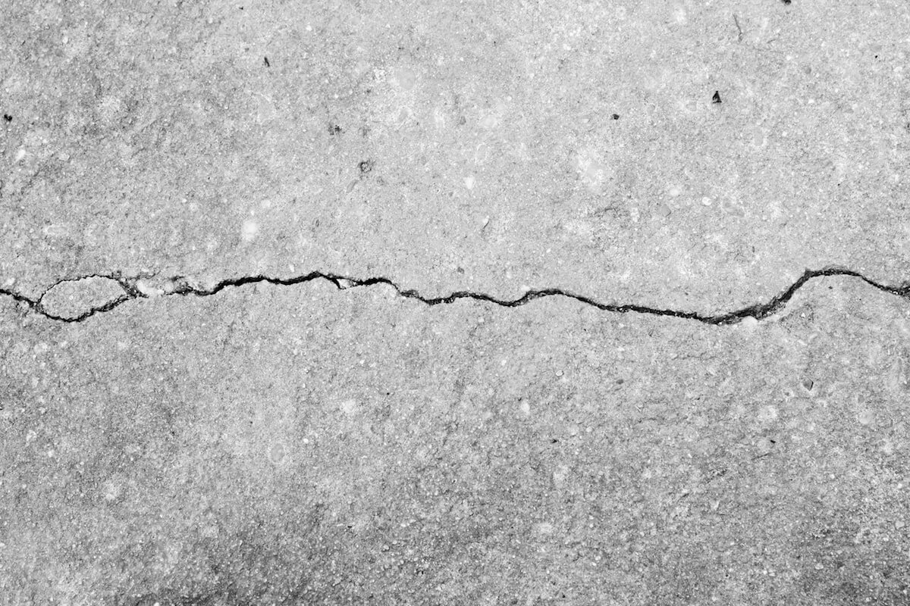

#### Image Processing Techniques:

All the steps in the image processing section are explained below: 

##### Gray Scaling and Averaging

Firstly, the images are transformed in a new grayscale image and are blurred. This makes the images easier to visualize the image processing in next steps. 

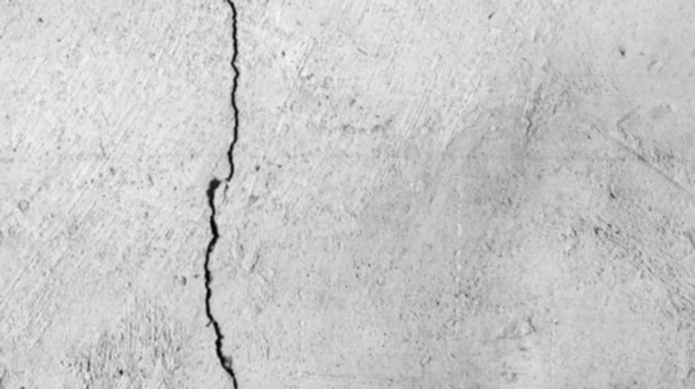 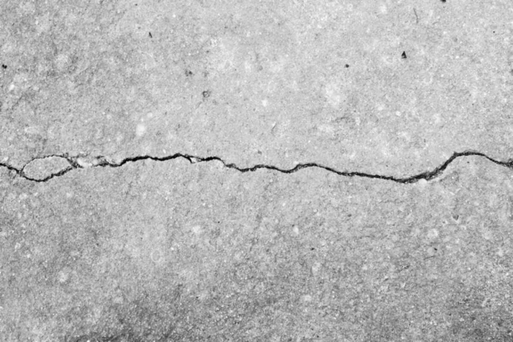

<pre>              Blurred Image                                           Blurred Image</pre>

##### Logarithmic transformation

Logarithmic transformation is used to replace all pixel values of an image with its logarithmic values. This transformation is used for image enhancement as it expands dark pixels of the image as compared to higher pixel values. If we apply this method on an image having higher pixel values then it will enhance the image more and actual information of the image will be lost. After applying the log transformation in to our sample blurred images, they look like below.

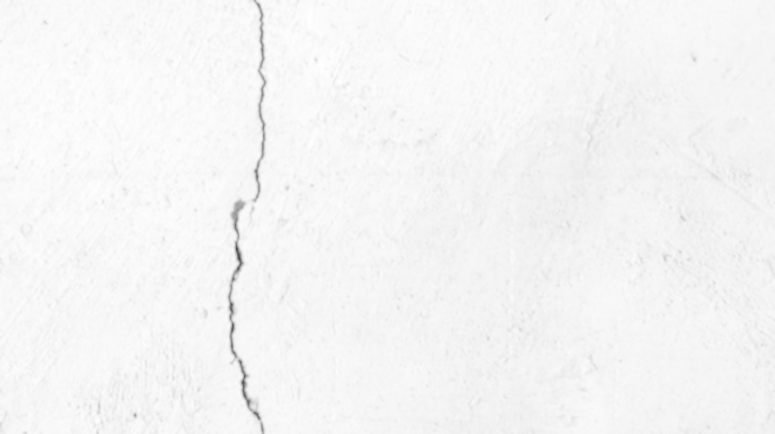 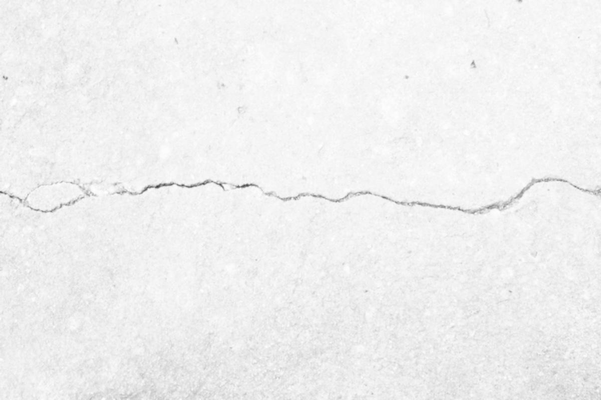

<pre>           Log Transformed Image                                   Log Transformed Image</pre>

##### Image Smoothening: Bilateral Filter

The bilateral filter also uses a Gaussian filter in the space domain, but it also uses one more (multiplicative) Gaussian filter component which is a function of pixel intensity differences. This method preserves edges, since for pixels lying near edges, neighboring pixels placed on the other side of the edge, and therefore exhibiting large intensity variations when compared to the central pixel, will not be included for blurring. So the sample logarithmic transformed images become after applying the bilateral filtering.

 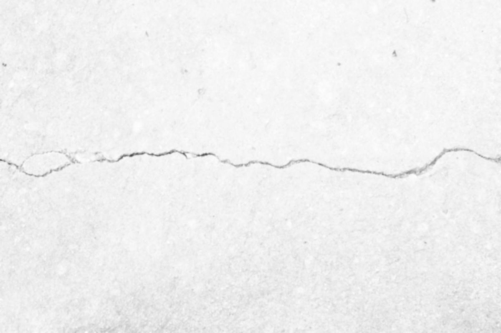

<pre>           Bilateral Filtered Image                           Bilateral Filtered Image</pre>

#### Image Segmentation Techniques

##### Canny edge detection

Canny edge detection is a technique to extract useful structural information from different vision objects and dramatically reduce the amount of data to be processed. It uses multi-stage algorithm to detect a wide range of edges in images. 

Canny algorithm consists of three main steps:

1. Find the intensity gradient of the image: In this step the scale of the gradient vector is calculated for each pixel.
2. Non-maximum suppression: The aim of this step is to “thin” the edge to obtain a one-pixel width edge.
3. Threshold hysteresis: Finally, a two-step threshold hysteresis is applied in order to decrease the fake edges.

At this point canny algorithm is applied to detect the crack edges in our bilateral filtered as following.

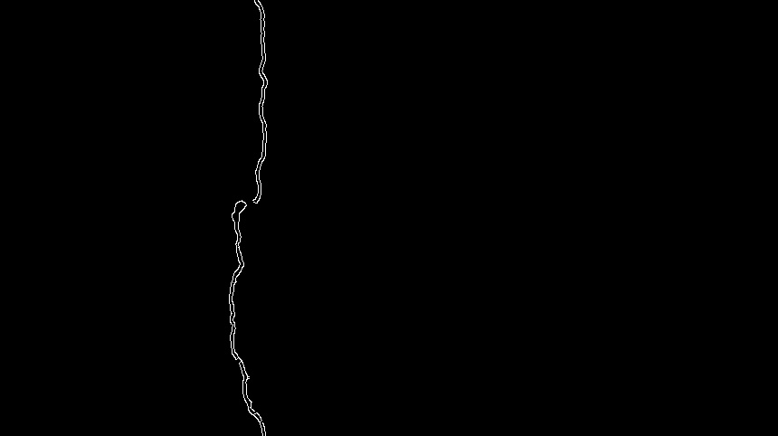 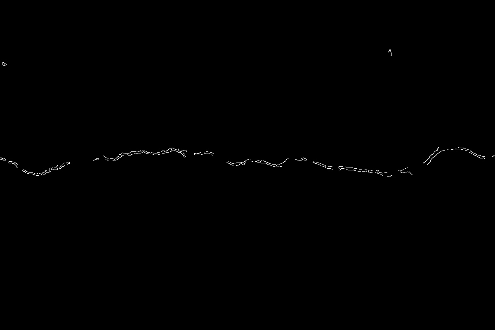

<pre>           Canny Edges Image                                   Canny Edges Image</pre>

##### Morphological closing operator

Morphological transformations are some simple operations based on the image shape. It is normally performed on binary images. It needs two inputs, one is our original image, second one is called structuring element or kernel which decides the nature of operation. 
There are many different types of morphological filtering, but after analyzing the results, the best filter for this detection is the closing filter. Closing filter helps to fill minor gaps in the image making the main crack continuous and more detailed. It is useful in closing small holes inside the foreground objects, or small black points on the object. Closing filter is defined as a dilation followed by an erosion.

Here we apply the morphological closing operator onto our canny edges detected images.

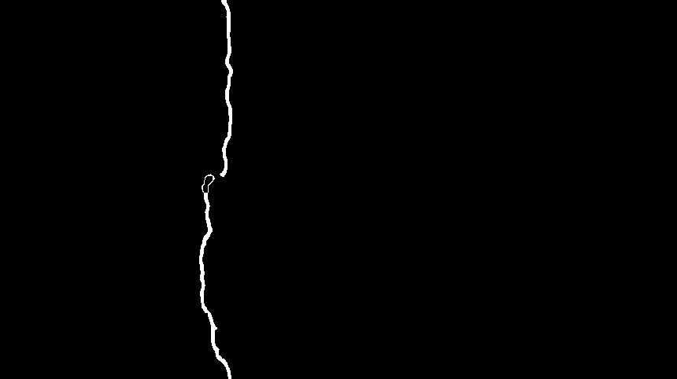 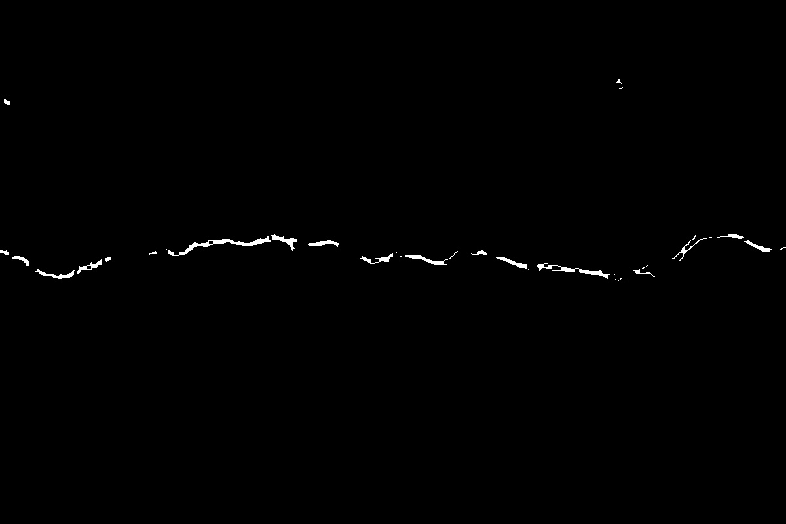

<pre>           Morphological Closing Image                          Morphological Closing Image</pre>

#### Feature extraction

There are various types of algorithms like (SIFT, SURF, ORB) that could be used in feature detection/extraction. SIFT and SURF are patented so not free for commercial use, while ORB is free. SIFT and SURF detect more features than ORB, but ORB is faster. ORB stands for Oriented FAST and Rotated BRIEF. It combines features of FAST and BRIEF for feature extraction and description. It has very fast computational speed, efficient memory usage, and high matching accuracy. ORB can be used instead of SIFT and SURF for feature extraction. 
ORB method when applied into our morphological closing images we get the following result:

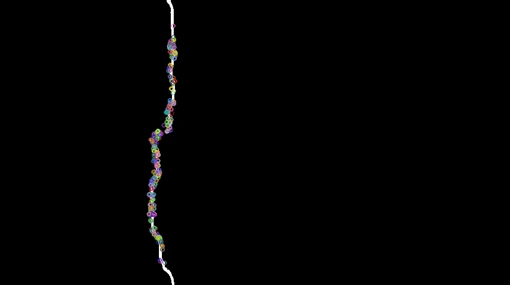 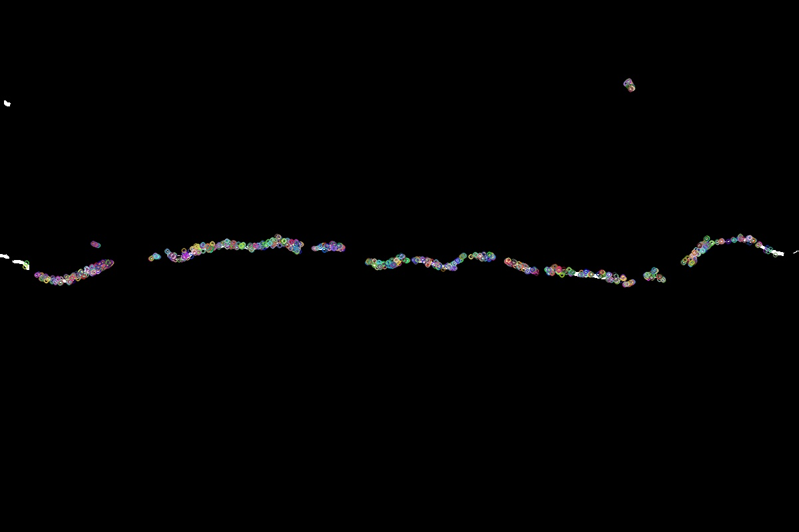

<pre>           Feature Detected Image                              Feature Detected Image</pre>

### Result and Discussion

Here we tried with around twenty images of both crack and non-crack to test. Without some cases, the cracks become very visible accurately in our output image. So we can say that 80-90% accuracy can be possible if the images are very clear or transparent. From our final output images we can classify them into several crack types and some classification techniques need to be applied for that.
